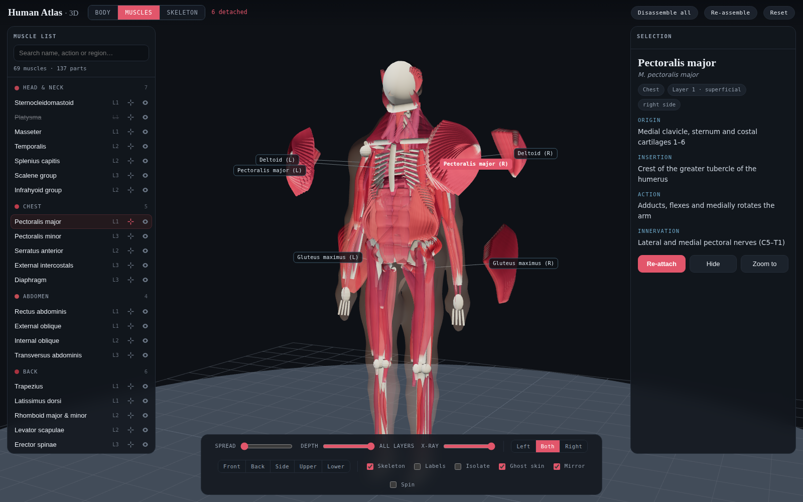

# Human Atlas 3D

An interactive 3D human figure that runs in a browser with no build step, no
model files and no network access. The figure starts as a skinned body and can
be stripped back to muscle and then to bone, and any single muscle can be taken
off the body on its own. Skin, skeleton and all 69 muscles are generated
procedurally from code at load time.



## What it does

- **Three layers, one figure.** *Body* is the person with skin on; *Muscles*
  fades the skin away and shows the musculature over the skeleton; *Skeleton*
  leaves bone alone. While dissecting, a translucent ghost of the skin keeps the
  body's outline for reference.
- **69 muscles in one view**, 137 individual parts once the bilateral pairs are
  built, laid over a simplified skeleton.
- **Disassemble any muscle individually.** Click it in the 3D view or in the
  list and press *Disassemble*; it floats off the body along its own outward
  axis, keeps a leader line back to where it belongs, and labels itself.
  *Disassemble all* turns the whole figure into an exploded diagram.
- **Depth slider** peels the anatomy back: superficial only, through
  intermediate, or all three layers.
- **X-ray slider**, left/right isolation, per-muscle hide, isolate mode,
  labels, and view presets for front, back, side, upper and lower body.
- **Reference data** for each muscle: origin, insertion, action and innervation.

## Running it

Open `index.html` in a browser. That is the whole install. Nothing is fetched at
runtime: `vendor/three.min.js` is bundled, and the page falls back to the three.js
CDN only if that file is missing.

To serve it locally instead:

```sh
python3 -m http.server 8000
# then open http://localhost:8000
```

## Controls

| Input | Action |
| --- | --- |
| Drag | Orbit |
| Wheel / pinch | Zoom |
| Shift+drag, right-drag | Pan |
| Click | Select a muscle |
| Double-click | Disassemble it and zoom in |
| `D` | Disassemble / re-attach the selection |
| `H` | Hide / show it |
| `I` | Isolate |
| `X` | X-ray |
| `L` | Labels |
| `1` `2` `3` | Body, muscles, skeleton |
| `G` | Ghost skin on/off |
| `R` | Reset everything |

## How the skin is built

The body surface is an implicit surface. About seventy rounded cones and
ellipsoids describe the figure's proportions, blended with a smooth union so
limbs flow into the trunk without seams. That is unioned with a second field:
the finished anatomy is voxelised, chamfer-transformed into a distance field and
offset outwards by 9 mm, so the skin is guaranteed to enclose every muscle and
takes its shape from the real muscle mass underneath. The combined field is
polygonised with naive surface nets, smoothed with a Taubin filter and given
normals from the field's own gradient.

The head is a second, finer mesh at 3 mm, because a nose and an eye socket are
features the body's 6 mm grid would erase. Hair, brows and lips are painted into
the mesh's vertex colours rather than modelled: at this resolution a modelled
hairline reads as a helmet, while a painted one follows the skull exactly.

## How the anatomy is built

There are no `.glb` or `.obj` assets. Two generators in `js/geom.js` produce
almost every structure:

- `belly(path, opts)` sweeps a fusiform muscle belly along a Catmull-Rom spline.
  The radius follows a profile that tapers to tendon at both ends, and the
  cross-section is an ellipse, so the same function makes a round biceps and a
  flat strap like sartorius. Vertex colours are baked as it goes, so thin
  tendinous ends read pale and the thick belly reads red.
- `fan(origin, insertion, opts)` runs a sheet of fascicles from an origin
  polyline to an insertion polyline. That covers pectoralis major, trapezius,
  latissimus dorsi, the deltoid, the glutes and the abdominal obliques.

Both take an `up` vector that decides which way the muscle is flattened. For
sheet muscles it defaults to the outward normal of the trunk, computed as an
ellipse in cross-section, because the torso is much wider than it is deep.

`js/landmarks.js` holds the skeletal attachment points that everything else is
measured from, in metres, for a 1.80 m figure standing in anatomical position.
Only the right side exists; left-side muscles are mirrored geometry, so the two
sides can never drift apart.

## Layout

```
index.html            page shell
css/styles.css        interface styling
js/geom.js            belly / fan / plate geometry generators
js/landmarks.js       skeletal attachment points and rib paths
js/skeleton.js        the simplified skeleton
js/skin.js            implicit-surface skin, head and surface nets
js/muscles.js         head, neck, chest and abdomen
js/muscles-upper.js   back, shoulder, arm and forearm
js/muscles-lower.js   hip, thigh and leg
js/orbit.js           camera controller
js/app.js             scene, interaction and interface
vendor/three.min.js   bundled three.js r128
```

## Adding a muscle

Append an entry to one of the `js/muscles*.js` files. It appears in the list, the
search index, the depth layers and the disassembly controls automatically:

```js
M({
  id: 'popliteus', name: 'Popliteus', latin: 'M. popliteus',
  group: 'Leg', layer: 3, side: 'pair',
  origin: 'Lateral condyle of the femur',
  insertion: 'Posterior surface of the proximal tibia',
  action: 'Unlocks the extended knee by rotating the femur laterally',
  nerve: 'Tibial nerve (L4–S1)',
  build: function (c) {
    return c.G.belly([c.p('condyleLat'), c.p('tibPlateau', -0.02, -0.03, -0.02)], {
      r: 0.010, w: 1.3, h: 0.6, up: [0, 0, -1], color: c.color, tendon: c.tendon
    });
  }
});
```

## Accuracy

This is a teaching diagram, not a medical reference. Attachments, layering and
actions follow standard anatomy, but the shapes are parametric approximations:
fascicle counts are stylised, the skeleton is simplified, and the hands, feet,
face and deep intrinsic muscles are represented only in outline. The figure is
one body: a 1.80 m adult of athletic build, not a population.

## Console access

The viewer is exposed as `HB.app` for scripting: `HB.app.detach('deltoid.R')`,
`HB.app.select('soleus.L')`, `HB.app.detachAll(true)`, `HB.app.reset()`.
`HB.app.rebuildSkin({ headOnly: true })` re-polygonises the skin with different
options, which is how the body plan was tuned.
